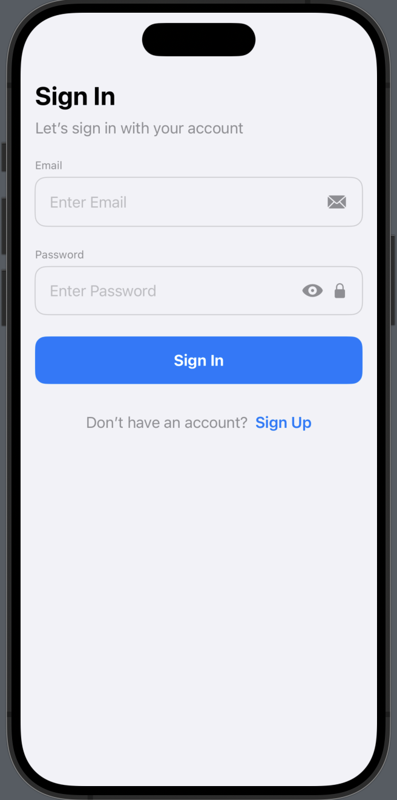
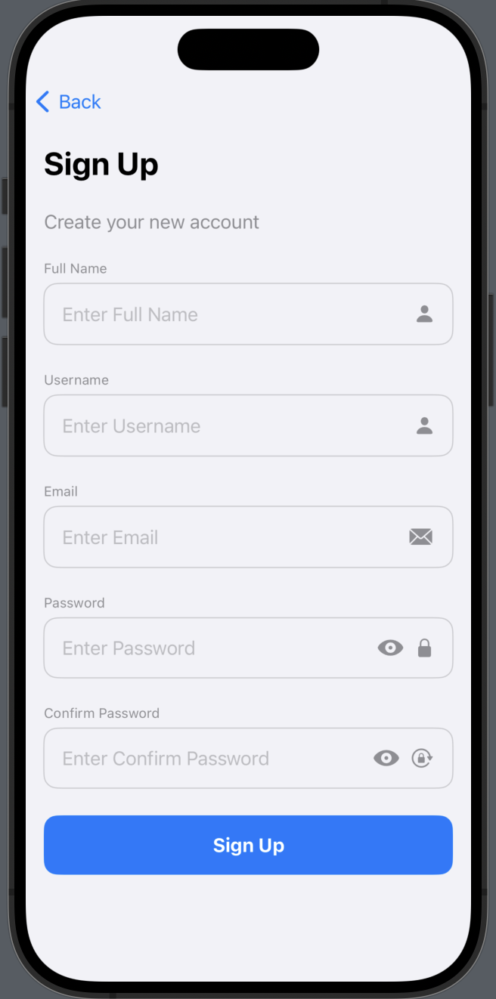
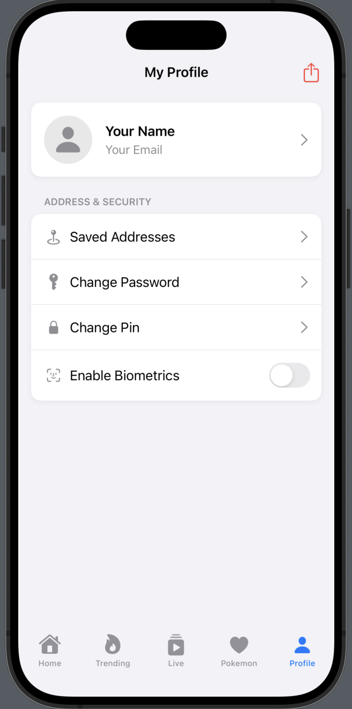
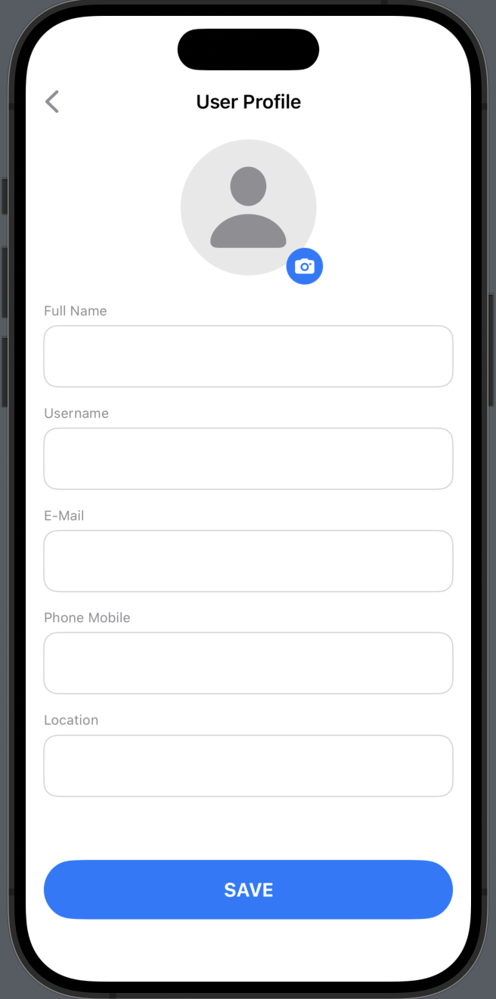
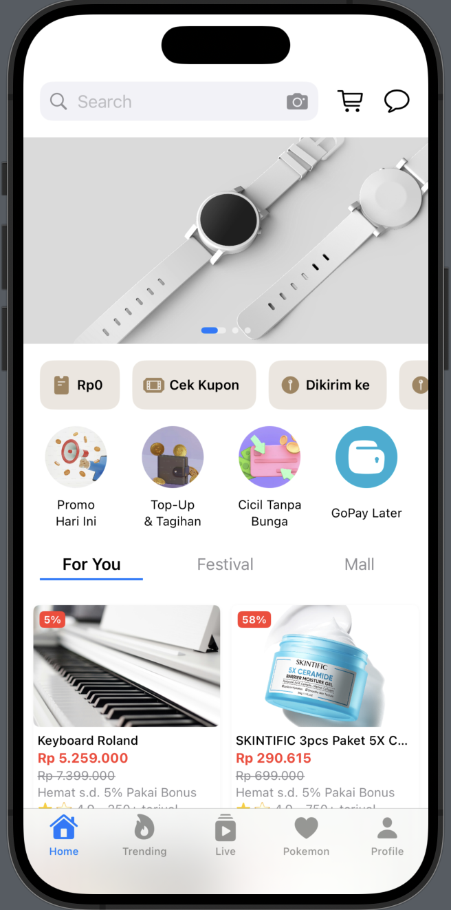

# 📱 MazzApp

**MazzApp** is an iOS application built with **SwiftUI** as part of my personal portfolio.  
This project demonstrates my skills in **modern SwiftUI development, reactive data handling with Combine, API integration**, and creating a **smooth, user-friendly interface**.  

---

## ✨ Key Features

### 🔑 Authentication
- **Sign In & Sign Up** functionality with persistence using **Realm**.
- User session stored locally to keep users logged in.
- Validation and error handling for secure and smooth authentication.

### 🏠 Home Page
- Product listing in a **2-column responsive grid layout**.
- **Custom Banner Carousel** with capsule page indicator and animated progress.
- **Sticky Header Tabs** (Planned) for category-based products.
- Data fetched from **local Mockoon API**.
- Displays discount, promo text, rating, and store name like modern e-commerce apps.

### 📊 Trending Page *(Planned)*
- Will display trending products dynamically from Mockoon.
- Support for **favorite products** with local persistence (CoreData).

### 🎥 Live Page *(Planned)*
- TikTok-style video list using **AVPlayer** and Combine.

### 🐱 Pokemon Page *(Planned)*
- Integration with **Pokémon API**.
- Supports **search and infinite scroll**.

### ⚙️ Profile Page
- Displays user data saved in Realm during Sign Up.
- Supports Log Out functionality.

### 📝 Profile Detail Page
- Shows detailed information of the logged-in user.
- Data is fetched directly from Realm database to ensure persistence even after app restart.

---

## 🛠️ Technologies Used

- **Language:** Swift  
- **UI Framework:** SwiftUI  
- **Architecture:** MVVM  
- **Reactive Programming:** Combine  
- **Networking:** URLSession  
- **Image Loading:** [Kingfisher](https://github.com/onevcat/Kingfisher)  
- **Mock API:** Mockoon  
- **Data Persistence:** (planned) CoreData, Realm  

---

## 🗂 Mockoon API
The project uses a **local Mockoon API** for product and home data.  

To run the API:  
1. Open **Mockoon** app.  
2. Import the provided files in `Mockoon/`:
   - `MazzApp_HomeData.json`
   - `MazzApp_Products.json`
3. Start the local server on **localhost:3002** (or custom port).
4. Run the app — data will appear dynamically.

⚠️ **Note:** Without running the local Mockoon API, no data will be displayed.

---

## 📸 Screenshots

### 🔑 Authentication
| Sign In | Sign Up |
|---------|---------|
|  |  |

---

### ⚙️ Profile
| Profile Page | Profile Detail |
|--------------|----------------|
|  |  |

---

### 🏠 Home
| Home Page |
|-----------|
|  |

